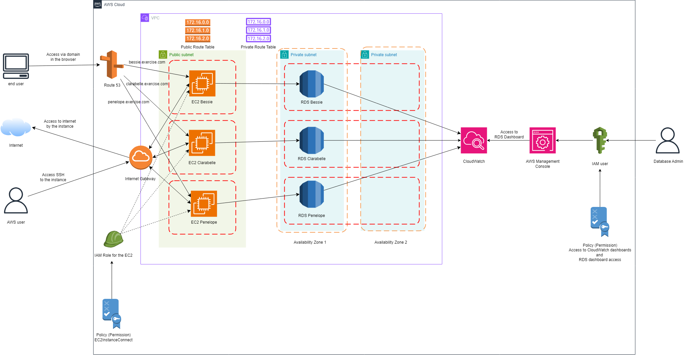

# Terraform Implementation of AWS Infrastructure for a Multi-Tenancy SaaS Application

## Architecture:

This project contains terraform configuration files on creating multi-tenancy AWS architecture for deploying a SaaS application. The architecture contains EC2 and RDS instances inside a Custom VPC on AWS. The exact components are presented in the diagram below:

## Set Up:

- Install [AWS CLI](https://docs.aws.amazon.com/cli/latest/userguide/getting-started-install.html) and [configure](https://docs.aws.amazon.com/cli/latest/userguide/cli-chap-configure.html) it.
- Install [Terraform](https://developer.hashicorp.com/terraform/tutorials/aws-get-started/install-cli).
- Add, update or remove an environment via editing the local variable `environments` in `locals.tf` file. We use AWS Secrets Manager in a key/value format to store the database master user credentials (username and password) for RDS instance for each tenant.
- Register a domain in AWS Route 53 and update the variable `domain_name` variable in `locals.tf` to match the registered domain.

## Running the Configuration:

**Initializing the Terraform directory:**
Run the command: `terraform init`
**Apply the Terraform Config to AWS**
Run the command: `terraform apply`
** To get the created IAM Database Admin User login credentials**
Run the command: `terraform output -json > terraform_output.json`
**To destroy everything that was created by the Terraform Config**
Run the command: `terraform destroy`
